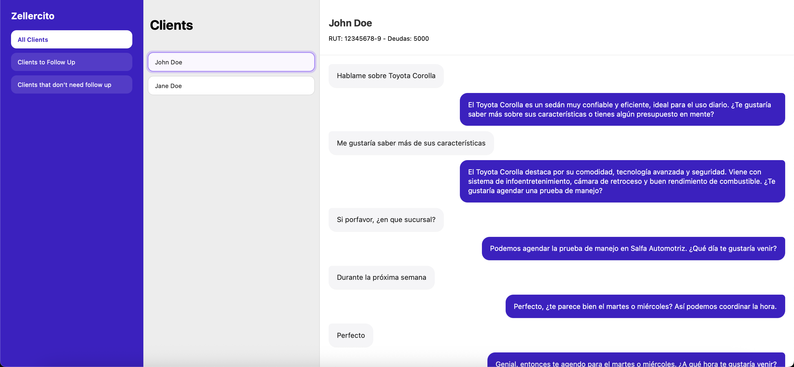

# zeller-frontend

El frontend de producción lo puedes encontrar en: [https://my-zeller.netlify.app](https://my-zeller.netlify.app)

Consideraciones que debes tener:
Al hacer un post mediante curl, postman u otro, se debe recargar la página para que aparezca.

---

## Ejecución local
Ahora si quieres correr este frontend de forma local. Es muy sencillo.
Solo debes ejecutar:
```bash
yarn build
yarn dev
```

¡Y listo! Funcionando y corriendo.

---

## Explicación del diseño
### 1. Vistas


Diseñé el frontend queriendo que toda la información estuviera a disposición, por lo que la dividí en 3 partes: el sidebar con los diferentes segmentos de clientes, el centro con la lista seleccionable de cada uno y a la derecha la conversación e información del cliente. Así se mantiene el contexto siempre visible y se optimiza el flujo de trabajo al tener datos clave y acciones (como generar mensajes) en una sola vista.

En cuanto a los colores, opté por el morado como color principal. El cual es típico en el mundo de la tecnología, y aporta sensación de innovación y modernidad.

### 2. Mejoras al front
* Agregar fecha y hora de los mensajes para más claridad
* Comenzar vista con el primer chat abierto para más eficiencia
* Cargar nuevos mensajes automáticamente a las vistas para no tener que recargar todo, aunque principalmente no hice esto para evitar tantos requests al back y que se pueda sobrecargar

## Mejoras o extensiones
* Login / Sign up con auth0 para más seguridad
* Agregar buscador de chats para cuando los clientes sean muchos
* Agregar endpoints para eliminar y actualizar clientes, mensajes o deudas
* Que los mensajes soporten images y audio para la IA
* Expandir modelos, marcas y sucursales de los autos